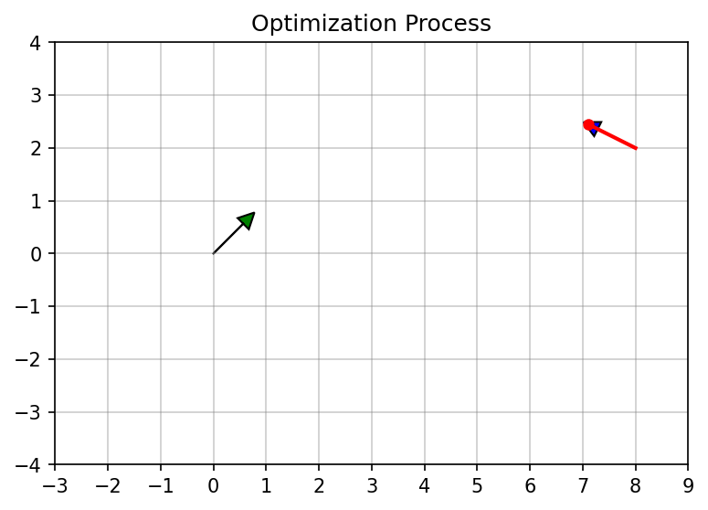
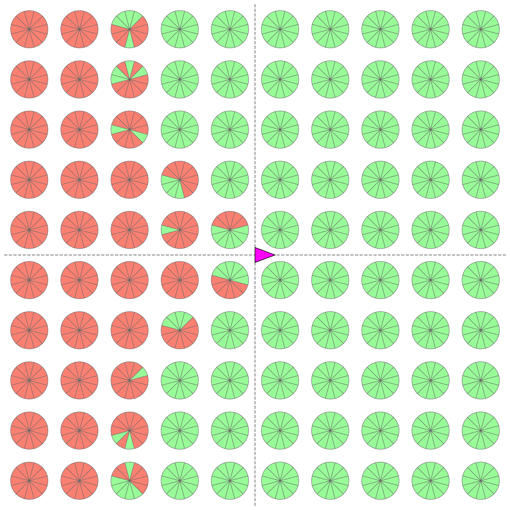
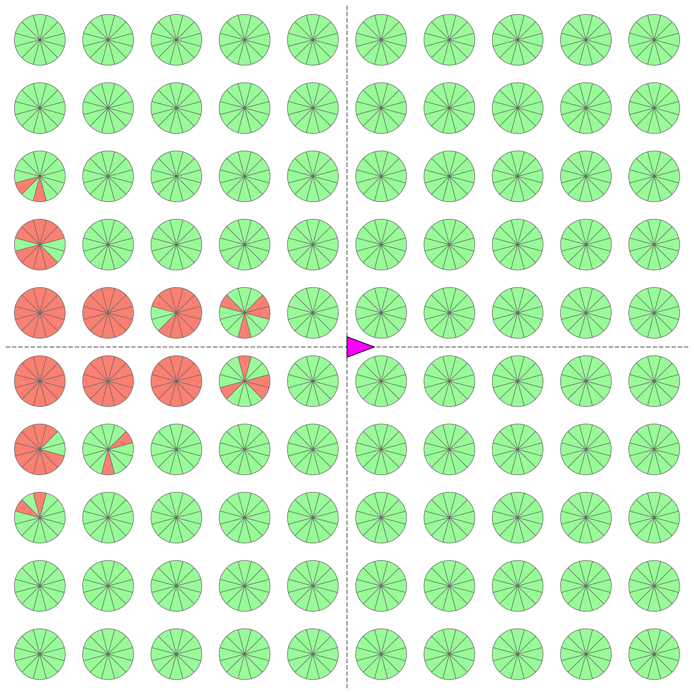

# Efficient Motion Primitives Generation

[](README_RU.md)
[](https://opensource.org/licenses/MIT)


This repository contains the implementation and experimental code for the motion primitives generation method described in the paper **"An Efficient Method for Generating Kinematically Feasible
Motion Primitives via Curvature Parameterization."**

The core idea is to represent a motion primitive as a short trajectory (for a robot with a bicycle kinematic model) whose curvature is defined by a cubic polynomial. Generating a primitive involves solving a boundary value problem (BVP) to determine the polynomial coefficients based on the start and end poses. The paper introduces a **reparameterization of this trajectory via curvature values at knot points**, which significantly accelerates the convergence of the numerical method (Newton's method) and improves planning robustness compared to the baseline approach.

---

<p align="center">
  
  <br>
  <em>Visualization of Newton's method convergence during primitive generation.</em>
</p>

---

## 📂 Project Structure

```text
.
├── common/                   # Helper modules (graphics, data structures)
├── experiments/              # Scripts for reproducing experiments from the paper
│   ├── run_experiment.py          # Experiment 1: Performance Comparison (Time/Success)
│   ├── run_grid_experiment.py     # Experiment 2: Reachability Maps generation
│   ├── experiments_process.ipynb  # Data analysis and plotting
│   └── ...                        # .csv files with results and saved plots
├── trajectory-generation/    # Core generation algorithms
├── primitives_examples.ipynb # DEMO: Interactive generation, visualization, and examples
└── README.md
```

## 🚀 Quick Start

1. Open the notebook `primitives_examples.ipynb`.
2. It demonstrates several use cases of the proposed generation method:
    * Visualization of Newton's method iterations.
    * Examples of simple and complex maneuvers (turns, S-curves).
    * Example of a control set generation.


## 📊 Reproducing Experiments

All scripts support parallel computing. Use the `--help` flag for argument details.

### Experiment 1: Performance and Convergence

This experiment consists of two stages: test case generation and execution.

**1. Test Case Generation:**
Creates a file with tasks (random start and goal conditions).

```bash
python experiments/run_experiment.py generate --output experiments/test_cases.txt
```

**2. Running the Comparison:**
Runs the baseline and proposed methods on the generated tests.

```bash
# --workers: number of parallel processes (defaults to cpu_count)
python experiments/run_experiment.py run --input experiments/test_cases.txt --output experiments/results.csv --workers 4
```

### Experiment 2: Reachability Maps

Generates primitives for a dense grid of goal states to evaluate robustness and construct reachability maps.

```bash
python experiments/run_grid_experiment.py --output experiments/grid_results_corrected.csv --workers 4
```

### Analysis of Results

To process the resulting `.csv` files and build plots (as seen in the paper), use the notebook:
`experiments/experiments_process.ipynb`. As an example, a visual comparison of method robustness (reachability maps) is shown below.

<p align="center">
<table>
<tr>
<td align="center"><b>Baseline Algorithm</b></td>
<td align="center"><b>Proposed Reparameterization</b></td>
</tr>
<tr>
<td align="center"></td>
<td align="center"></td>
</tr>
<tr>
<td colspan="2" align="center"><em>Reachability maps for 1200 tasks: green sector — successful generation for the corresponding target heading angle, red — failure.</em></td>
</tr>
</table>
</p>

## 📄 Citation

If you use this code in your research, please cite our paper:

```bibtex
<under review>
```

## 🔗 Related Works

If you found this project useful, we invite you to check out our work on **State Lattice Planning**. The trajectory assembly in that work relies on the exact primitive generation code provided here:

> **[MeshA*: Efficient Path Planning With Motion Primitives](https://arxiv.org/abs/2412.10320)**\
> *This paper proposes the MeshA\* algorithm for path planning using motion primitives. Unlike the classical approach (State Lattice), where the search is conducted over a state graph, MeshA\* performs a search directly over grid cells, fitting kinematically feasible primitive sequences on the fly. This allows reducing planning time by 1.5–2 times compared to baseline methods while maintaining completeness and optimality guarantees.*

```bibtex
@misc{agranovskiy2025meshaefficientpathplanning,
      title={MeshA*: Efficient Path Planning With Motion Primitives}, 
      author={Marat Agranovskiy and Konstantin Yakovlev},
      year={2025},
      eprint={2412.10320},
      archivePrefix={arXiv},
      primaryClass={cs.RO},
      url={[https://arxiv.org/abs/2412.10320](https://arxiv.org/abs/2412.10320)}, 
}
```
