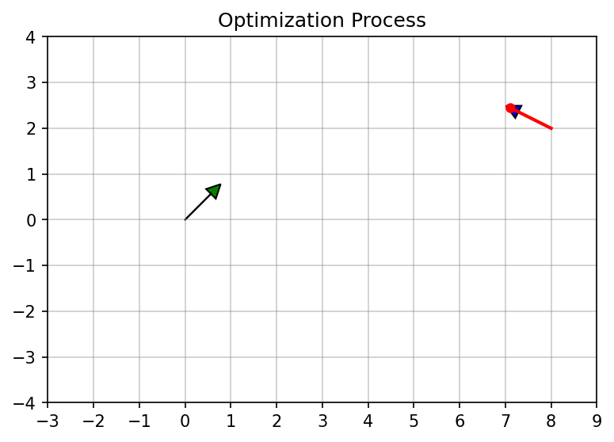
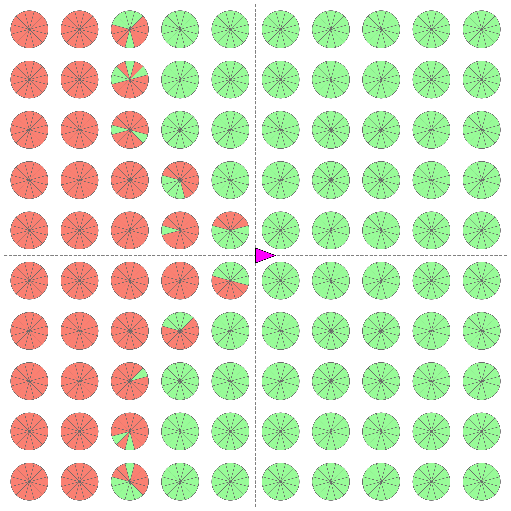
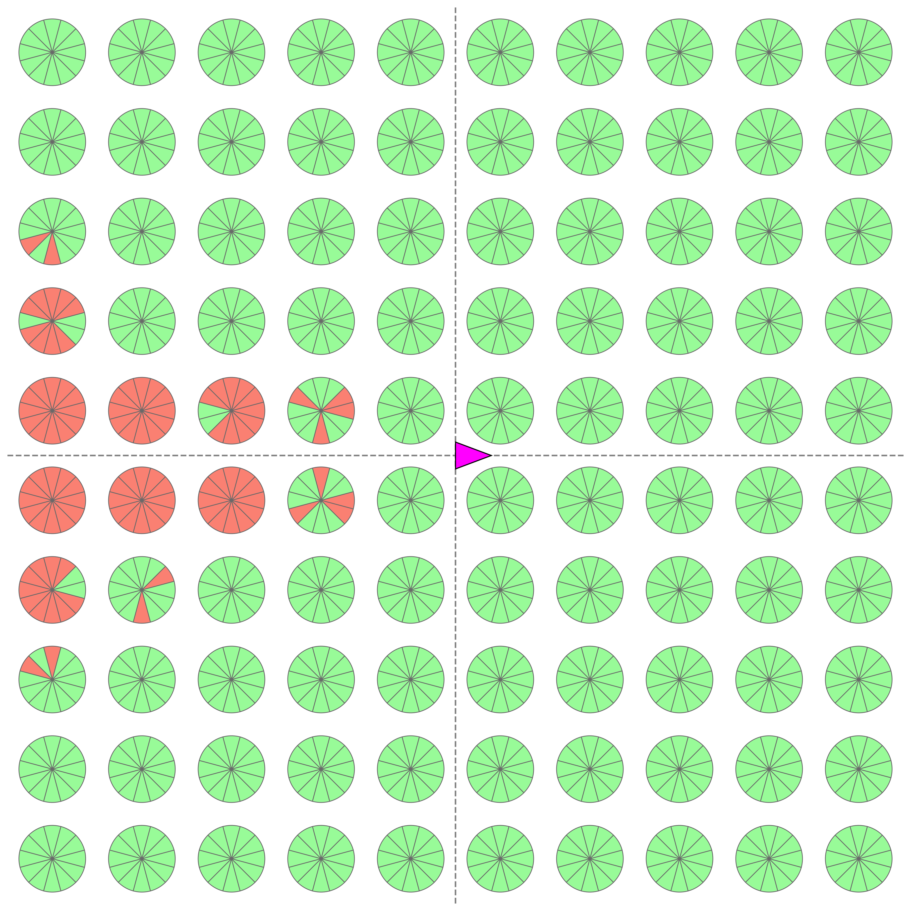

# Эффективная генерация примитивов движения

[](https://opensource.org/licenses/MIT)


Репозиторий содержит реализацию и экспериментальный код для метода генерации примитивов движения, описанного в статье **"Эффективный метод генерации кинематически-
согласованных примитивов движения на основе параметризации по кривизне."**

Основная идея метода заключается в представлении примитива движения как короткой траектории (для робота с велосипедной моделью движения), кривизна которой описывается полиномом третьей степени. Генерация примитива заключается в решении краевой задачи, когда необходимо подобрать коэффициенты этого полинома по начальной и конечной точке примитива. В статье описывается репараметризации этой траектории через значения кривизны в узловых точках, что позволяет значительно ускорить сходимость численного метода (Ньютона) и повысить робастность планирования по сравнению с базовым подходом.

---

<p align="center">
  
  <br>
  <em>Визуализация сходимости метода Ньютона при генерации примитива.</em>
</p>

---

## 📂 Структура проекта

```text
.
├── common/                   # Вспомогательные модули (графика, структуры данных)
├── experiments/              # Скрипты для воспроизведения экспериментов из статьи
│   ├── run_experiment.py          # Эксперимент 1: Сравнение производительности (Time/Success)
│   ├── run_grid_experiment.py     # Эксперимент 2: Построение карт достижимости
│   ├── experiments_process.ipynb  # Анализ результатов и построение графиков
│   └── ...                        # .csv файлы с результатами и сохраненные графики
├── trajectory-generation/    # Основные алгоритмы генерации
├── primitives_examples.ipynb # ДЕМО: Интерактивная генерация и визуализация, примеры примитивов
└── README.md

```

## 🚀 Быстрый старт


1. Откройте ноутбук `primitives_examples.ipynb`.
2. В нем реализовано несколько примеров использования предлагаемого метода генерации примитивов:
    * Визуализация итераций метода Ньютона.
    * Примеры простых и сложных маневров (развороты, s-образные кривые).
    * Пример управляющего набора.


## 📊 Воспроизведение экспериментов

Все скрипты поддерживают параллельные вычисления. Для справки по аргументам используйте флаг `--help`.

### Эксперимент 1: Производительность и Сходимость

Этот эксперимент проходит в два этапа: генерация тестовых сценариев и запуск тестирования.

**1. Генерация тестовых случаев:**
Создает файл с задачами (начальные и конечные условия).

```bash
python experiments/run_experiment.py generate --output experiments/test_cases.txt
```

**2. Запуск сравнения методов:**
Запускает базовый и предложенный методы на сгенерированных тестах.

```bash
# --workers: количество процессов (по умолчанию cpu_count)
python experiments/run_experiment.py run --input experiments/test_cases.txt --output experiments/results.csv --workers 4
```

### Эксперимент 2: Карты достижимости

Генерация примитивов для плотной сетки целевых состояний для оценки робастности и построения карт.

```bash
python experiments/run_grid_experiment.py --output experiments/grid_results_corrected.csv --workers 4
```

### Анализ результатов

Для обработки полученных `.csv` файлов и построения графиков (как в статье) используйте ноутбук:
`experiments/experiments_process.ipynb`. В качестве примера получающегося графика, ниже приведено визуальное сравнение робастности методов (карты достижимости).

<p align="center">
<table>
  <tr>
    <td align="center"><b>Базовый алгоритм</b></td>
    <td align="center"><b>Предлагаемая репараметризация</b></td>
  </tr>
  <tr>
    <td align="center"></td>
    <td align="center"></td>
  </tr>
  <tr>
    <td colspan="2" align="center"><em>Карты достижимости для 1200 задач: зеленый сектор — успешное построение для соответствующего целевого угла направления, красный — неудача.</em></td>
  </tr>
</table>
</p>


## 📄 Цитирование

Если вы используете этот код в своих исследованиях, пожалуйста, сошлитесь на нашу статью:

```bibtex
@article{Аграновский_Яковлев_2026,
  title={Эффективный метод генерации кинематически-согласованных примитивов движения на основе параметризации по кривизне},
  volume={25}, url={https://ia.spcras.ru/index.php/sp/article/view/17396},
  DOI={10.15622/ia.25.4.4},
  number={4},
  journal={Информатика и автоматизация},
  author={Аграновский, Марат Антонович and Яковлев, Константин Сергеевич},
  year={2026},
  month={июл.},
  pages={1090-1113}
}
```


## 🔗 Связанные работы

Если вам понравился этот проект, предлагаем ознакомиться с нашей работой по планированию движения на решетке состояний (State Lattice Planning). Для сборки итоговой траектории в той работе использовался именно этот код генерации примитивов:

> [**MeshA\*: Efficient Path Planning With Motion Primitives**](https://arxiv.org/abs/2412.10320)\
> *В этой работе предложен алгоритм MeshA\* для планирования траектории с использованием примитивов движения. В отличие от классического подхода (State Lattice), где поиск ведется по графу состояний, MeshA\* выполняет поиск непосредственно по ячейкам сетки, на лету подбирая кинематически допустимые последовательности примитивов. Это позволяет сократить время планирования в 1.5–2 раза по сравнению с базовыми методами, сохраняя при этом гарантии полноты и оптимальности решения.*

```bibtex
@article{Agranovskiy_Yakovlev_2026,
  title={MeshA*: Efficient Path Planning with Motion Primitives},
  author={Agranovskiy, Marat and Yakovlev, Konstantin},
  url={https://ojs.aaai.org/index.php/AAAI/article/view/41004},
  DOI={10.1609/aaai.v40i43.41004},
  journal={Proceedings of the AAAI Conference on Artificial Intelligence},
  month={Mar.},
  year={2026},
  number={43},
  volume={40},
  pages={36785-36792}
}
```
